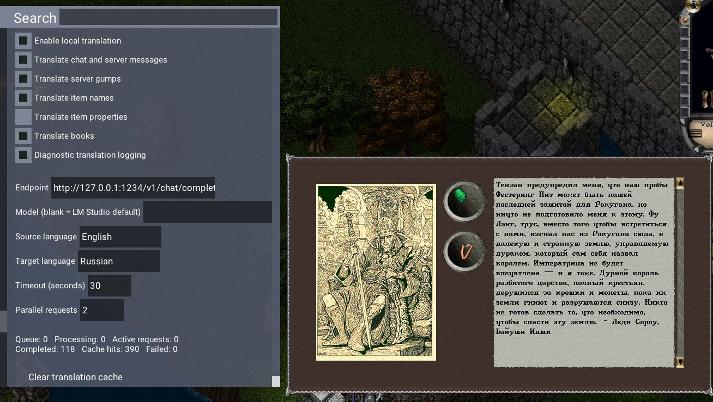
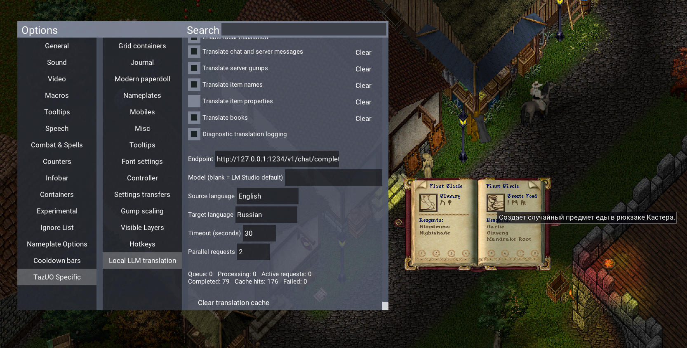
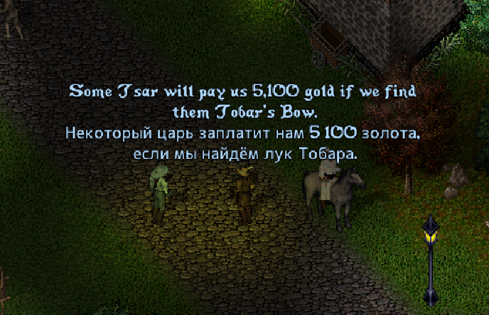
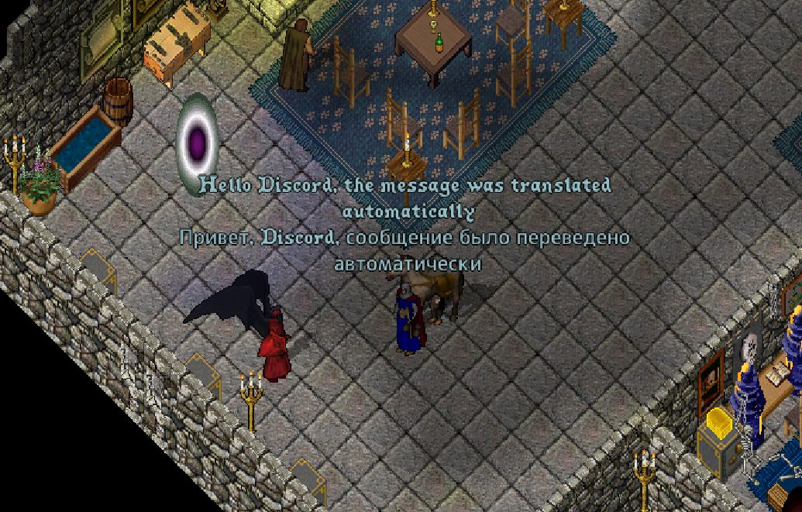

# TazUO Translate

**TazUO Translate** is a custom Ultima Online client based on [TazUO](https://github.com/PlayTazUO/TazUO), with built-in local AI translation. It connects to an OpenAI-compatible local LLM endpoint such as [LM Studio](https://lmstudio.ai/) and translates supported game text while you play.

The project is intended for players who want to play an English-language shard in another language without sending their game text to a third-party translation service.

> This is an independent fork. It is not affiliated with the upstream TazUO project or its servers. Always follow the rules of the shard you play on.

## What is translated

When local translation is enabled, TazUO Translate supports the following categories:

- Incoming chat, NPC dialogue, and server messages.
- Server gumps, including long text translated progressively.
- Server books and their headers.
- Item names and item properties received from the server.
- Static world-object labels shown after clicking objects such as `bonfire` or `stone chair`.
- Spellbook tooltip descriptions.
- Outgoing Russian speech translated to a configurable target language before it is sent to the server, including regular speech, whisper, yell, emote, guild, alliance, and party messages.

Every category can be enabled or disabled separately in **Options → TazUO Specific → Local LLM translation**. The outgoing-speech option is disabled by default.

## Screenshots









## Local LLM setup

1. Start an OpenAI-compatible local server. LM Studio is the primary supported option.
2. In LM Studio, start the local server. Its default endpoint is:

   ```text
   http://127.0.0.1:1234/v1/chat/completions
   ```

3. In the game, open **Options → TazUO Specific → Local LLM translation**.
4. Enable **Enable local translation** and choose the categories you need.
5. Set the endpoint, optional model name, source language, target language, timeout, and parallel-request limit.

Incoming translation uses the configured source and target languages. Outgoing speech uses Russian as its source language and has its own **Outgoing target language** setting, so it can be sent to other players in English or another chosen language.

### Outgoing speech behavior

Messages containing Cyrillic characters are translated before their network packet is sent. Their order is preserved when multiple messages are entered quickly. Messages already written in English are sent immediately.

Commands beginning with `[`, `.`, or `-` are never translated. This protects common shard and client commands from accidental modification.

## Cache and controls

Translations are cached on disk at:

```text
%LOCALAPPDATA%\TazUO\Translations\cache.json
```

The cache is separated by translation category, language pair, and model. The Local LLM translation page provides:

- Clear controls for each category.
- A global cache clear.
- A per-gump **LLM** menu for forgetting or regenerating that gump's translation.
- Queue, active-request, completion, cache-hit, and failure statistics.
- Diagnostic logging for troubleshooting.

Turning a visible-text category off restores the original text where the client retains it. Clearing a category also invalidates outstanding requests, so stale results are not written back into the cache.

## Build from source

Requirements:

- Windows x64
- .NET 10 SDK
- A valid Ultima Online installation for runtime assets

Build the client from the repository root:

```powershell
dotnet build src\ClassicUO.Client\ClassicUO.Client.csproj -c Debug
```

The debug client assembly is produced at:

```text
bin\Debug\net10.0\win-x64\TazUO.dll
```

Run the test suite with:

```powershell
dotnet test tests\ClassicUO.UnitTests\ClassicUO.UnitTests.csproj -c Debug
```

## Project layout

- `src/ClassicUO.Client/` — client, UI, network handling, and local translation integration.
- `src/ClassicUO.Client/Game/Managers/LocalTranslationService.cs` — OpenAI-compatible request queue, cache, and translation scenarios.
- `tests/ClassicUO.UnitTests/` — unit tests.
- `external/` — third-party dependencies used by the client.

## Contributing

Useful contributions include translation-quality fixes, additional UI text sources, cache and queue improvements, tests, documentation, and compatibility work with local OpenAI-compatible servers.

Before opening a pull request:

1. Keep changes focused and avoid committing local UO assets, caches, model files, or credentials.
2. Run the build and relevant tests.
3. Describe the text source or packet/UI path affected by the change.
4. Include screenshots or a short reproduction path for UI-facing fixes when possible.

Never commit API keys, GitHub tokens, or other secrets. Use a fine-grained token with the smallest required permissions and revoke exposed credentials immediately.

## Upstream and license

This project is based on TazUO, which originated as a fork of ClassicUO. Please consult [LICENSE.md](LICENSE.md) and the upstream repositories for their respective licensing and attribution requirements.
